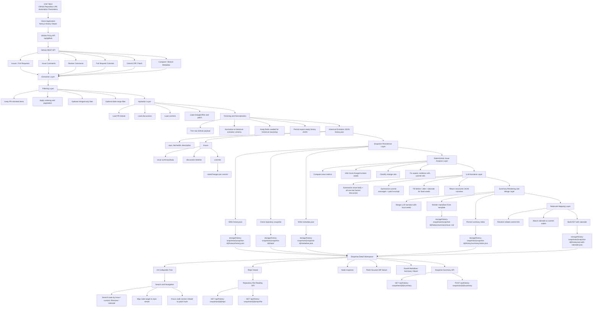
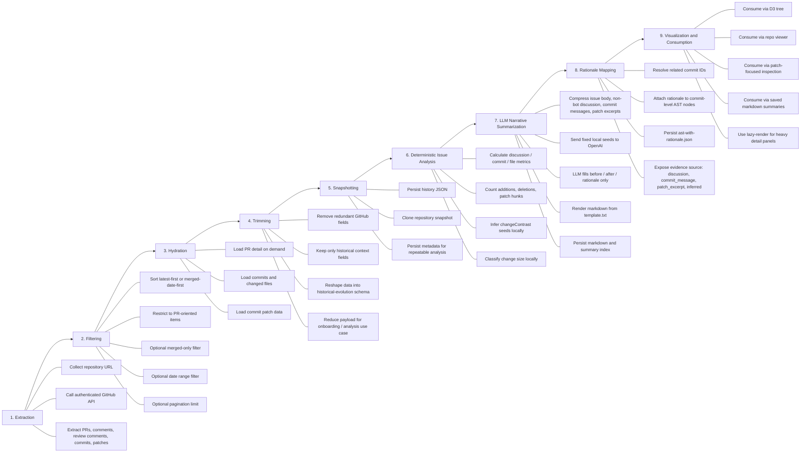
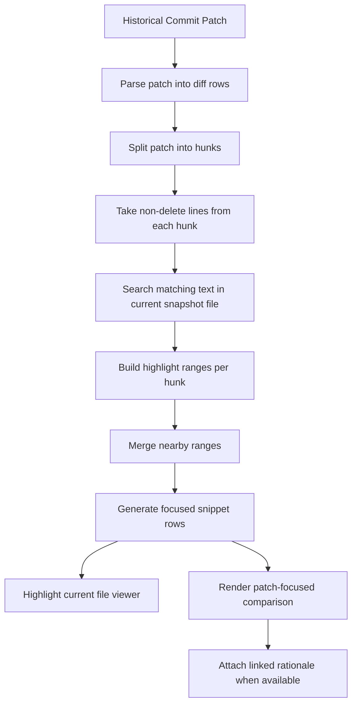
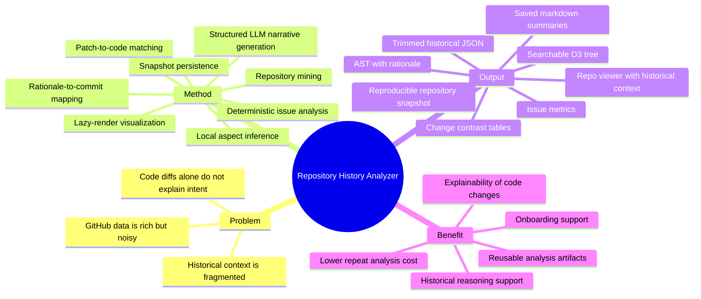

# Repository History Analyzer - Architecture and Methodology

## Overview

Dokumen ini menjelaskan arsitektur terbaru dari `Repository History Analyzer` setelah penambahan:

- standardisasi summary PR berbasis OpenAI
- penyimpanan summary markdown per issue di snapshot
- pembentukan `ast-with-rationale.json`
- penghubungan rationale ke commit dan file change
- penyimpanan `evidenceRefs` untuk traceability sumber rationale
- perhitungan metrik issue secara deterministik dari payload dan patch
- inferensi lokal untuk aspek `changeContrast` memakai heuristic / AST-friendly rules
- pembatasan peran LLM agar hanya mengisi narasi `before`, `after`, dan `rationale` untuk aspek yang sudah ditentukan lokal
- tabel `Change Contrast` dan tabel `Impact` pada summary markdown
- konsumsi rationale di Tree-Mapping dan Repository Viewer
- optimasi lazy rendering untuk mencegah browser crash saat membuka detail besar

Secara konseptual, sistem ini bukan hanya mengambil histori GitHub, tetapi mengubah histori tersebut menjadi artefak analitis yang bisa dipakai ulang: `history.json`, metrik issue, seed aspek perubahan, kumpulan summary markdown, AST dengan rationale, dan clone repository snapshot yang bisa diinspeksi.

## Architecture and Data Engineering Flow



## Methodology Detail



## Data Model and Artifacts

### 1. Historical export payload

Artefak dasar sistem adalah `history.json`. Struktur ini berisi:

- `repo`
- `fetchedAt`
- `exportType`
- `description`
- `issues[]`

Setiap issue menyimpan:

- `issueNumber`
- `title`
- `url`
- `createdAt`
- `summary`
- `discussion[]`
- `commits[]`

Setiap commit menyimpan:

- `sha`
- `message`
- `author`
- `committedAt`
- `codeChanges[]`

Setiap code change menyimpan:

- `filename`
- `patch`

Payload ini menjadi sumber utama untuk semua tahap berikutnya: snapshotting, summary generation, tree building, dan repository inspection.

### 2. Snapshot storage artifacts

Setelah export selesai, sistem menyimpan beberapa artefak ke `storage/history-snapshots/{snapshot-id}`:

- `history/history.json`
- `metadata.json`
- `repo/` hasil clone repository
- `history/summary/index.json`
- `history/summary/issue-<n>.md`
- `history/ast-with-rationale.json`

Dengan pola ini, snapshot menjadi unit analisis yang reproducible. Artinya, setelah artefak terbentuk, workspace bisa dibuka ulang tanpa harus memanggil GitHub API atau OpenAI API lagi.

### 3. Summary artifacts

`index.json` menyimpan hasil summary terstruktur untuk semua issue yang sudah digenerate. Setiap issue summary memuat:

- informasi issue dasar
- `background`
- `whatChanged[]`
- `changeContrast[]`
- `changeSize`
- `metrics`
- `impact`
- `testingVerification`
- `notes`
- `markdown`
- `markdownFile`
- `generatedAt`
- `model`

Bagian `whatChanged[]` menjadi penghubung penting ke AST karena memuat:

- `change`
- `rationale`
- `relatedCommitIds[]`
- `evidenceRefs[]`
- `evidenceSource`

Bagian `changeContrast[]` menangkap kontras perubahan dalam bentuk tabel:

- `aspect`
- `before`
- `after`
- `rationale`
- `relatedCommitIds[]`
- `evidenceRefs[]`
- `evidenceSource`

Pada versi terbaru, `aspect` tidak dipilih oleh LLM. Sistem menentukan `aspect` secara lokal dari heuristic / AST-friendly rules terhadap patch. LLM hanya mengisi narasi `before`, `after`, dan `rationale` berdasarkan seed yang sudah ditetapkan.

Bagian `metrics` dihitung deterministik dari payload dan patch, bukan dari LLM:

- `discussionCount`
- `commitCount`
- `fileChangedCount`
- `codeChangeCount`
- `additions`
- `deletions`
- `hunkCount`

Bagian `changeSize` juga dihitung lokal dari metrik tersebut. Klasifikasi yang dipakai adalah:

- `kecil`
- `sedang`
- `besar`

Bagian `impact` tetap disimpan sebagai struktur `user`, `system`, dan `developer`, tetapi markdown summary merendernya sebagai tabel agar lebih mudah dipindai.

### 4. AST with rationale

`ast-with-rationale.json` adalah representasi tree hasil pengayaan dari `history.json` dengan informasi summary. Node ini dipakai oleh Tree-Mapping viewer dan menambahkan node `rationale` di bawah commit yang relevan.

Node rationale minimal membawa:

- label perubahan
- rationale
- sumber evidensi
- referensi evidensi konkret
- commit terkait

## Engineering Process

### 1. Extraction engineering

Sistem mengambil data dari GitHub REST API lewat proxy internal. Proxy ini menyederhanakan pengelolaan token, rate-limit visibility, dan pemanggilan API dari client.

Tahap ini mengumpulkan:

- daftar PR atau issues
- detail PR
- issue comments
- review comments
- daftar commit dalam PR
- diff commit
- changed files PR
- metadata compare dan branch

Data discussion yang masuk ke pipeline historis mencakup dua tipe utama:

- `issue_comment`
- `review_comment`

### 2. Filtering engineering

Filtering dilakukan sebelum hydration penuh supaya request tidak boros. Strategi yang dipakai:

- membatasi ke item PR-oriented
- memfilter merged-only jika diminta
- memfilter date range
- membatasi page load

Pada versi terbaru, filter merged-only plus date range tidak lagi hanya mengandalkan `created_at`, tetapi juga memanfaatkan search merged-date supaya kasus PR yang dibuat lebih awal tapi merge pada tanggal target tetap ikut terbaca.

### 3. Hydration engineering

Hydration hanya mengambil data yang dibutuhkan untuk membangun narasi perubahan:

- semua diskusi non-bot
- commit yang terkait
- file yang berubah
- patch yang dipakai untuk line matching

Pendekatan ini menjaga payload tetap cukup kaya untuk analisis, tapi tidak seluas payload mentah GitHub.

### 4. Trimming and normalization engineering

Payload GitHub mentah mengandung banyak field yang tidak relevan untuk use case historis. Karena itu dilakukan:

- trimming field berlebih
- normalisasi nama field
- pembentukan skema yang konsisten untuk issue, discussion, commit, dan file change

Hasilnya adalah `history.json` yang lebih kecil, lebih stabil, dan lebih mudah dipakai ulang oleh viewer dan proses LLM.

### 5. Snapshotting engineering

Snapshotting dilakukan agar analisis historis tidak bergantung pada kondisi repository saat runtime. Proses ini menyimpan:

- history JSON yang sudah dinormalisasi
- clone repository pada branch target atau fallback default branch
- metadata snapshot

Manfaat utamanya adalah reproducibility: file yang diperiksa di viewer selalu berasal dari snapshot yang sama.

### 6. Deterministic issue analysis engineering

Sebelum memanggil LLM, sistem menjalankan analisis lokal di `issueAnalysis.ts`. Tujuannya adalah mengurangi ketergantungan pada model untuk hal-hal yang bisa dihitung atau diklasifikasikan secara engineering.

Analisis lokal menghitung:

- jumlah diskusi per issue
- jumlah commit per issue
- jumlah file unik yang berubah
- jumlah code change entry
- jumlah line additions dan deletions dari patch
- jumlah patch hunk

Metrik ini juga dijumlahkan di level dataset sehingga halaman snapshot bisa menampilkan total untuk semua issue di dalam `history.json`.

Selain metrik, sistem membentuk `changeContrastSeeds[]`. Seed ini menjadi kontrak lokal yang mengunci:

- `aspect`
- alasan heuristic internal
- `relatedCommitIds[]`
- `evidenceRefs[]`
- `evidenceSource`

Pemilihan `aspect` memakai aturan lokal berbasis patch:

- `logic`: perubahan conditional, branching, guard, return, atau validasi
- `algorithm`: perubahan iterasi, selection strategy, sorting, reducer, distance calculation, atau pencarian nilai terdekat
- `struktur kode`: perubahan import, export, type, interface, class, atau dependency antar modul
- `behavior`: perubahan render, pointer, hover, focus, highlight, visibility, atau interaksi
- `functions`: perubahan deklarasi fungsi, signature, helper, atau batas tanggung jawab fungsi

Pendekatan ini bersifat AST-friendly: aturan dibuat agar bisa dinaikkan menjadi parser AST formal per bahasa di kemudian hari. Implementasi saat ini masih membaca patch line dan pola sintaks, sehingga belum menjadi AST parser bahasa pemrograman penuh.

`changeSize` juga diputuskan secara lokal. Sistem menghitung skor dari jumlah file, commit, hunk, additions, dan deletions. Dari sana perubahan diklasifikasikan sebagai `kecil`, `sedang`, atau `besar`.

### 7. LLM narrative summarization engineering

Setelah snapshot tersedia, user bisa menggenerate summary standar per issue. Proses ini dilakukan dari snapshot, bukan dari data live GitHub.

Konteks yang dikirim ke OpenAI diperkecil dengan strategi hemat token:

- issue summary/body dibersihkan dari markdown berlebihan
- semua komentar bot dibuang
- semua discussion non-bot tetap dikirim, baik `issue_comment` maupun `review_comment`
- body setiap discussion entry dipotong setelah dibersihkan, sekitar 500 karakter per entry
- commit message dipakai dalam bentuk ringkas
- patch hanya dikirim sebagai excerpt kecil per file
- metrik lokal ikut dikirim sebagai konteks pendukung
- `changeContrastSeeds[]` ikut dikirim sebagai daftar aspek yang sudah fixed
- output diminta dalam JSON schema ketat, bukan markdown langsung

Pada tahap ini, LLM tidak lagi menentukan `aspect` untuk `changeContrast`. Schema output untuk `changeContrast` hanya meminta:

- `before`
- `after`
- `rationale`

Urutan output LLM harus mengikuti urutan seed lokal. Setelah response diterima, server menggabungkan narasi tersebut dengan seed lokal. Dengan desain ini, `aspect`, `evidenceRefs`, `relatedCommitIds`, dan `evidenceSource` tetap berasal dari deterministic analysis.

Rationale juga diarahkan memakai pola sebab, akibat, dan solusi. Format yang dituju adalah:

```text
Karena ... sehingga/maka/jadi ... Solusi: ...
```

Bahasa tidak wajib Indonesia; yang penting struktur alasannya tetap memuat sebab, akibat, dan solusi.

Untuk menjaga traceability, konteks yang dikirim ke model juga menyertakan reference ID eksplisit:

- discussion ref: `issue_comment:<id>` atau `review_comment:<id>`
- commit ref: `commit:<sha>`
- patch ref: `patch:<sha>:<filename>`

Markdown lalu dirender lokal dari `template.txt`, sehingga token output model tetap rendah dan format summary tetap konsisten.

Summary markdown terbaru merender:

- `What Changed` sebagai tabel
- `Change Contrast` sebagai tabel `Aspek | Sebelum | Sesudah | Rationale | Evidence`
- `Change Size` sebagai label klasifikasi dan rationale
- `Impact` sebagai tabel `Area | Impact`

### 8. Rationale mapping engineering

Setelah summary JSON didapat, sistem memetakan `relatedCommitIds` ke SHA commit aktual di issue. Hasilnya dipakai untuk:

- menempelkan rationale ke node commit
- membangun AST pengayaan
- menampilkan rationale di viewer level file dan patch

Bagian `evidenceSource` dipakai untuk menjaga traceability. Dengan begitu rationale tidak hanya tampil sebagai opini model, tetapi juga menunjukkan dasar pembentukannya:

- `discussion`
- `commit_message`
- `patch_excerpt`
- `inferred`

Selain itu, `evidenceRefs` dipakai untuk menunjuk bukti konkret yang mendasari rationale. Ini memungkinkan developer memverifikasi ulang sumber alasan secara manual dari snapshot atau dari GitHub asal.

## Matching Logic



Metode ini bukan AST parsing bahasa pemrograman formal, melainkan matching berbasis patch-to-current-file. Tujuannya adalah menghubungkan perubahan historis ke line yang paling relevan di snapshot repository saat ini.

Perlu dibedakan dari deterministic issue analysis: matching logic dipakai untuk highlight file viewer, sedangkan `changeContrastSeeds[]` dipakai untuk menentukan aspek perubahan. Keduanya sama-sama memanfaatkan patch, tetapi hasil akhirnya berbeda.

## Visualization and Consumption

### 1. D3 Tree-Mapping

Tree dipakai untuk menjelajahi histori dari level repository ke issue, discussion, commit, file change, dan rationale. Node bisa dicari dan dinavigasikan ke repo viewer. Pada node rationale, detail kini juga memuat `evidenceRefs` agar jejak alasan perubahan tetap dapat diaudit.

### 2. Repository Viewer

Repository viewer membaca file dari clone snapshot dan memperlihatkan:

- full file
- patch-focused snippet
- histori commit pada file
- rationale yang terhubung ke commit terkait

Ini membuat inspeksi bisa dilakukan sampai level line of code sambil tetap membawa konteks “mengapa perubahan ini dilakukan”.

### 3. Saved Markdown Summary Viewer

Summary yang sudah tergenerate ditampilkan ulang dari file markdown yang tersimpan di snapshot. Karena summary dibaca dari artefak snapshot, user tidak perlu regenerate saat membuka halaman lagi.

Summary terbaru menampilkan:

- tabel `What Changed`
- tabel `Change Contrast`
- klasifikasi `Change Size`
- tabel `Impact`
- daftar testing / verification
- notes

Halaman snapshot juga menghitung ulang metrik dari `history.json` saat render, sehingga total discussion, commit, files changed, dan code changes tetap bisa tampil walaupun summary lama belum diregenerate.

### 4. Lazy rendering strategy

Detail berat seperti:

- raw history JSON
- raw AST JSON
- markdown summary issue

dirender secara lazy hanya saat panel dibuka. Ini merupakan perubahan penting untuk mencegah browser freeze atau crash saat snapshot memuat artefak besar.

## What Changed From the Previous Architecture

Perubahan utama dibanding versi awal adalah:

1. Sistem tidak lagi berhenti di `history.json` dan clone repository.
   Sekarang snapshot juga menyimpan summary markdown, metrik issue, change contrast, dan AST dengan rationale.

2. Pipeline baru menambahkan tahap `Deterministic Issue Analysis`, `LLM Narrative Summarization`, dan `Rationale Mapping`.
   Ini mengubah sistem dari sekadar historical extractor menjadi historical interpretation workspace.

3. Aspek pada `changeContrast` kini ditentukan lokal dari heuristic / AST-friendly rules.
   LLM hanya mengisi `before`, `after`, dan `rationale`.

4. Tree-Mapping kini bukan hanya menampilkan issue, commit, dan patch, tetapi juga node rationale yang diturunkan dari summary.

5. Repository viewer kini bisa menampilkan alasan perubahan di level file dan patch, bukan hanya “apa yang berubah”.

6. Summary generation dibuat cache-first.
   Setelah artefak tersimpan, halaman snapshot memakai hasil yang ada tanpa perlu generate ulang.

7. Rendering detail besar sekarang memakai lazy strategy untuk menjaga stabilitas browser.

## Methodological Positioning

Secara metodologis, sistem ini menggabungkan beberapa pendekatan:

- repository mining
- snapshot-based reproducibility
- payload normalization
- deterministic issue metrics
- local aspect inference dengan heuristic / AST-friendly rules
- patch-to-file traceability
- LLM-assisted narrative generation dengan schema ketat
- rationale-linked historical inspection

Dengan kombinasi ini, sistem bukan hanya alat crawling GitHub, tetapi alat perekayasaan pengetahuan historis repository: mengambil data evolusi kode, menormalkannya, menghitung sinyal deterministik, memakai LLM hanya untuk narasi yang membutuhkan bahasa, lalu membuat hasilnya bisa dipakai ulang untuk onboarding, analisis, dan inspeksi teknis mendalam.

## Suggested Talking Points


