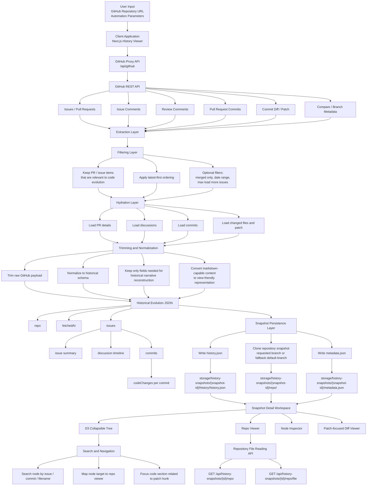
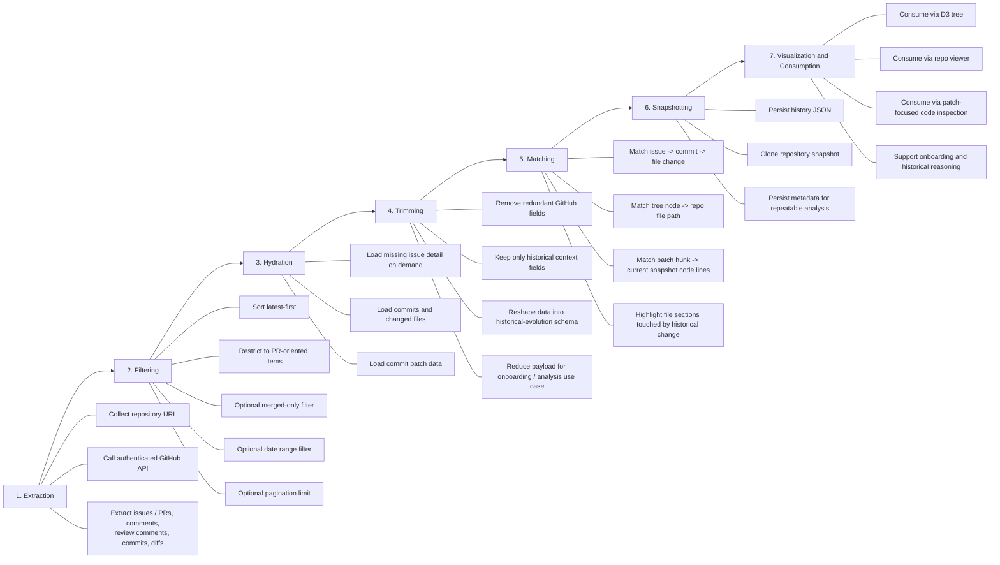
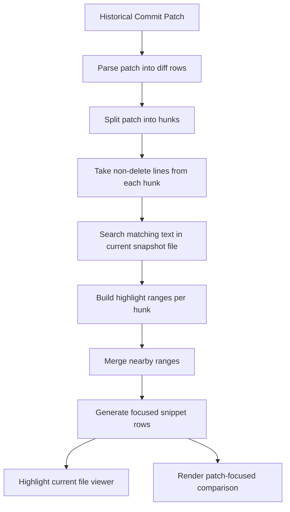
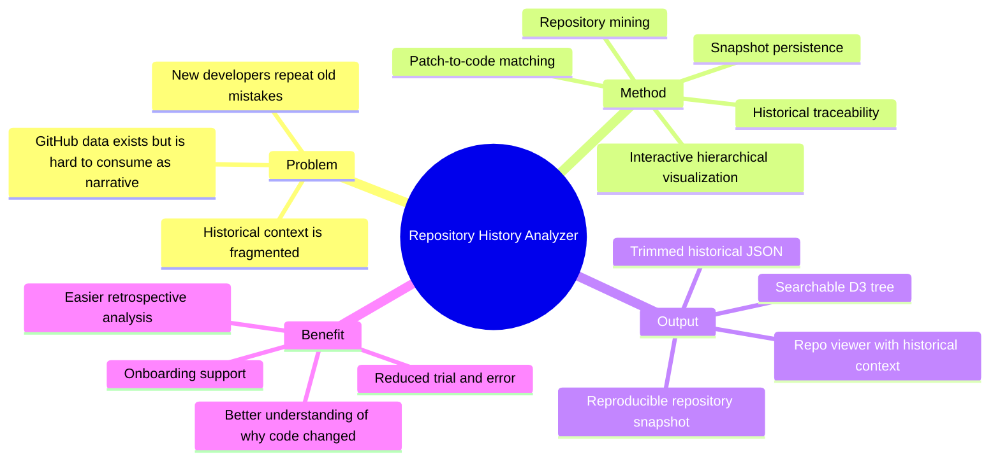

# Repository History Analyzer - Architecture and Methodology

## Architecture and Data Engineering Flow

```mermaid
flowchart TD
    A[User Input<br/>GitHub Repository URL<br/>Automation Parameters] --> B[Client Application<br/>Next.js History Viewer]

    B --> C[GitHub Proxy API<br/>/api/github]
    C --> D[GitHub REST API]

    D --> D1[Issues / Pull Requests]
    D --> D2[Issue Comments]
    D --> D3[Review Comments]
    D --> D4[Pull Request Commits]
    D --> D5[Commit Diff / Patch]
    D --> D6[Compare / Branch Metadata]

    D1 --> E[Extraction Layer]
    D2 --> E
    D3 --> E
    D4 --> E
    D5 --> E
    D6 --> E

    E --> F[Filtering Layer]
    F --> F1[Keep PR / issue items<br/>that are relevant to code evolution]
    F --> F2[Apply latest-first ordering]
    F --> F3[Optional filters:<br/>merged only, date range,<br/>max load more issues]

    F1 --> G[Hydration Layer]
    F2 --> G
    F3 --> G

    G --> G1[Load PR details]
    G --> G2[Load discussions]
    G --> G3[Load commits]
    G --> G4[Load changed files and patch]

    G1 --> H[Trimming and Normalization]
    G2 --> H
    G3 --> H
    G4 --> H

    H --> H1[Trim raw GitHub payload]
    H --> H2[Normalize to historical schema]
    H --> H3[Keep only fields needed for<br/>historical narrative reconstruction]
    H --> H4[Convert markdown-capable content<br/>to view-friendly representation]

    H1 --> I[Historical Evolution JSON]
    H2 --> I
    H3 --> I
    H4 --> I

    I --> I1[repo]
    I --> I2[fetchedAt]
    I --> I3[issues]
    I3 --> I31[issue summary]
    I3 --> I32[discussion timeline]
    I3 --> I33[commits]
    I33 --> I331[codeChanges per commit]

    I --> J[Snapshot Persistence Layer]
    J --> J1[Write history.json]
    J --> J2[Clone repository snapshot<br/>requested branch or fallback default branch]
    J --> J3[Write metadata.json]

    J1 --> K["storage/history-snapshots/{snapshot-id}/history/history.json"]
    J2 --> L["storage/history-snapshots/{snapshot-id}/repo/"]
    J3 --> M["storage/history-snapshots/{snapshot-id}/metadata.json"]

    K --> N[Snapshot Detail Workspace]
    L --> N
    M --> N

    N --> N1[D3 Collapsible Tree]
    N --> N2[Repo Viewer]
    N --> N3[Node Inspector]
    N --> N4[Patch-focused Diff Viewer]

    N1 --> O[Search and Navigation]
    O --> O1[Search node by issue / commit / filename]
    O --> O2[Map node target to repo viewer]
    O --> O3[Focus code section related to patch hunk]

    N2 --> P[Repository File Reading API]
    P --> P1["GET /api/history-snapshots/{id}/repo"]
    P --> P2["GET /api/history-snapshots/{id}/repo/file"]
```

## Methodology Detail

```mermaid
flowchart LR
    A[1. Extraction] --> B[2. Filtering]
    B --> C[3. Hydration]
    C --> D[4. Trimming]
    D --> E[5. Matching]
    E --> F[6. Snapshotting]
    F --> G[7. Visualization and Consumption]

    A --- A1[Collect repository URL]
    A --- A2[Call authenticated GitHub API]
    A --- A3[Extract issues / PRs, comments,<br/>review comments, commits, diffs]

    B --- B1[Sort latest-first]
    B --- B2[Restrict to PR-oriented items]
    B --- B3[Optional merged-only filter]
    B --- B4[Optional date range filter]
    B --- B5[Optional pagination limit]

    C --- C1[Load missing issue detail on demand]
    C --- C2[Load commits and changed files]
    C --- C3[Load commit patch data]

    D --- D1[Remove redundant GitHub fields]
    D --- D2[Keep only historical context fields]
    D --- D3[Reshape data into historical-evolution schema]
    D --- D4[Reduce payload for onboarding / analysis use case]

    E --- E1[Match issue -> commit -> file change]
    E --- E2[Match tree node -> repo file path]
    E --- E3[Match patch hunk -> current snapshot code lines]
    E --- E4[Highlight file sections touched by historical change]

    F --- F1[Persist history JSON]
    F --- F2[Clone repository snapshot]
    F --- F3[Persist metadata for repeatable analysis]

    G --- G1[Consume via D3 tree]
    G --- G2[Consume via repo viewer]
    G --- G3[Consume via patch-focused code inspection]
    G --- G4[Support onboarding and historical reasoning]
```

## Matching Logic

```mermaid
flowchart TD
    A[Historical Commit Patch] --> B[Parse patch into diff rows]
    B --> C[Split patch into hunks]
    C --> D[Take non-delete lines from each hunk]
    D --> E[Search matching text in current snapshot file]
    E --> F[Build highlight ranges per hunk]
    F --> G[Merge nearby ranges]
    G --> H[Generate focused snippet rows]
    H --> I[Highlight current file viewer]
    H --> J[Render patch-focused comparison]
```

## Suggested Talking Points

```mermaid
mindmap
  root((Repository History Analyzer))
    Problem
      Historical context is fragmented
      New developers repeat old mistakes
      GitHub data exists but is hard to consume as narrative
    Method
      Repository mining
      Historical traceability
      Snapshot persistence
      Interactive hierarchical visualization
      Patch-to-code matching
    Output
      Trimmed historical JSON
      Reproducible repository snapshot
      Searchable D3 tree
      Repo viewer with historical context
    Benefit
      Onboarding support
      Reduced trial and error
      Better understanding of why code changed
      Easier retrospective analysis
```
